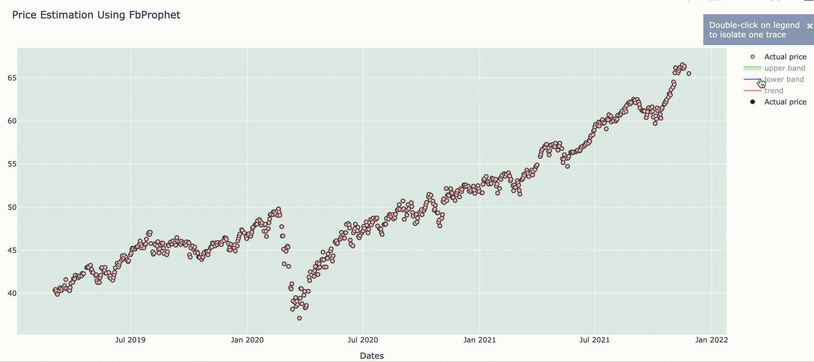

# Time-Series-stock

 
 

  

## 1. LSTM Keras
[See Notebook](AAPL.ipynb)
[See Notebook](forecasting%20stock%20price%20using%20keras.ipynb)

## 2. Using Facebook prophet
[Open with nbviewer](https://nbviewer.org/github/reejungkim/Time-Series-stock/blob/master/forecasting%20stock%20price%20using%20fbprophet.ipynb)

[See Notebook](forecasting%20stock%20price%20using%20fbprophet.ipynb)

   

## 3. Seasonal decomposition
[See Notebook](seasonal%20decomposition.ipynb)
